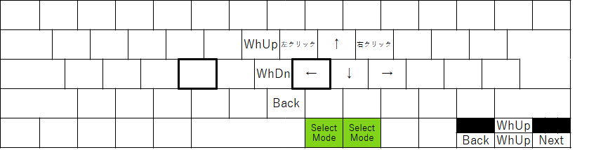

== 概要
* Autohotkey v2のスクリプト
* 「Space」などを修飾キーとして扱う。スペースキーダウンから300ms未満（スクリプト設定による）のアップで本来のキーを入力、それ以上で何もしない。キーを押しながら他のキーを押すことで、設定された動作 
* また、各キーの長押しでシフト押し動作
* 「Caps Lock」「ひらがな」は、ahkでの動作が不安定のため、レジストリでScanCodeを書き換え、F13、F14を割り当てる。レジストリでScanCodeを書き換えないと、AutoHotKeyが正しく扱えない。逆にレジストリを書き換えなければ、ahkファイルのF13に関する設定は無視される。 
* 日本語キーボード向け作っているのでUSキーボード向けには改変が必要
* 設定は、試行錯誤中のもの、かつ、特殊なキー配置を考慮しているので、カスタマイズすべき
* 誤動作発生の可能性がある（対策は施しているが、アプリなど動作環境依存） +
→キーリピート遅くすることで、誤動作の頻度を減少可能（事実上、必須と考えたほうがよい）

image::img/key_prop.png[]

* ShiftでCapsLock-Offできる環境以外の動作は不定（以下の設定を推奨）

image::img/CapsLock.webp[]

== キーマップ
キーの説明 +
C+ ctrlを押しながら +
S+ shiftを押しながら +
A+ altを押しながら +

タイトルの説明 +
and 同時押し + 
or どちらか +

緑地： shiftキーなど修飾キーが押されていても無効

=== 標準
image::img/std.webp[]

=== 標準(レジストリ書き換え)
image::img/stdreg.webp[]

== long_press_shift.ahk
=== 動作概要
* 「Space」や「F13」が修飾キー、つまり、このキーと他のキーの同時押しで特殊な動作が行われる。2つのキーはほぼ同じ役割だが、一部異なる
* 各キーの長押しでシフト押し動作、連打はできない。連打したいときは従来通りShiftキーで行うこと
* F13とEscの同時押しでReloadだが同時にリセットになる、不安定なときに押すとよい
* (Space or F13)と","の同時押しでテンキー入力モードの切り替え。該当キー以外のキー押下で解除
* (Space or F13)と"."の同時押しでキーマウスモードの切り替え。該当キー以外のキー押下で解除
* F14(ひらがな)/変換/無変換も修飾キーとして動作

=== キー長押し
image::img/shift.webp[]

=== スペース修飾
image::img/space.webp[]

=== F13修飾
image::img/f13.webp[]

=== (スペース and F13) 修飾
image::img/space_f13.webp[]

=== (Space or F13) and 無変換 修飾
image::img/space_f13_noconv.webp[]

=== (F14 or 変換 or 無変換) 修飾
image::img/hira.webp[]

=== テンキー入力モード
image::img/num.webp[]

=== キーマウスモード

=== その他
* shift+↑: _
* ctrl+shift+CapsLock: CapsLock-On +
