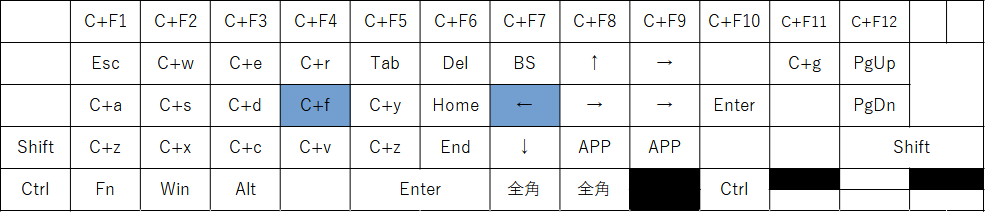

== space.ahk
* Autohotkey v2のスクリプト
* 「Space」などを長押しを修飾キーとして使う。キーダウンから200ms未満のアップで本来のキーを入力、それ以上で何もしない。キーを押しながら他のキーを押すことで、設定された動作。 
* 「Caps Lock」「ひらがな」はレジストリでScanCodeを書き換えることによりF13、F14を割り当てる。レジストリでScanCodeを書き換えないと、AutoHotKeyが正しく扱えない。逆にレジストリを書き換えなければ、ahkファイルのF13に関する設定は無視される。 
* 日本語キーボードを使うことが前提
* ctrl+shift+CapsLockで、CapsLock-On +
 ShiftでCapsLock-OffできるようにWndowsを設定したほうがよい
* 設定は、試行錯誤中のもの、かつ、特殊なキーボードが前提になっている
* Visual Studioでの利用を考えたものだが、#IfWinActiveは、いまのところ使っていない
* 隠し機能があるのでahkファイルを参照

== キーマップ
以下キーの説明 +
C+ ctrlを押しながら +
S+ shiftを押しながら +
A+ altを押しながら +

=== 標準
image::img/std.webp[]

=== 標準(レジストリ書き換え)
image::img/stdreg.webp[]

=== ひらがな/変換/無変換 修飾
image::img/hira.webp[]
ひらがな、変換、無変換は無効にしてある

=== スペース修飾
image::img/space.webp[]

=== F13修飾
image::img/f13.webp[]
F13を押しながらスペースで全角 +
スペースを押しながらF13は別な動作（スペース＋F13修飾）を参照 

=== スペース+F13修飾
image::img/space_f13.webp[]

=== セミコロン修飾

