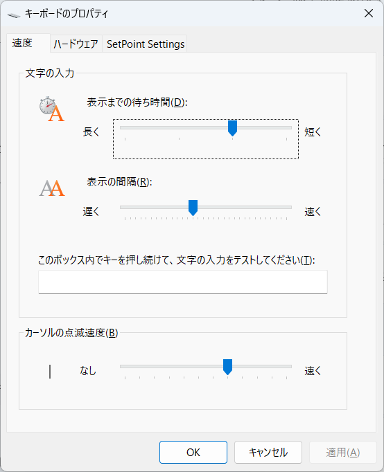
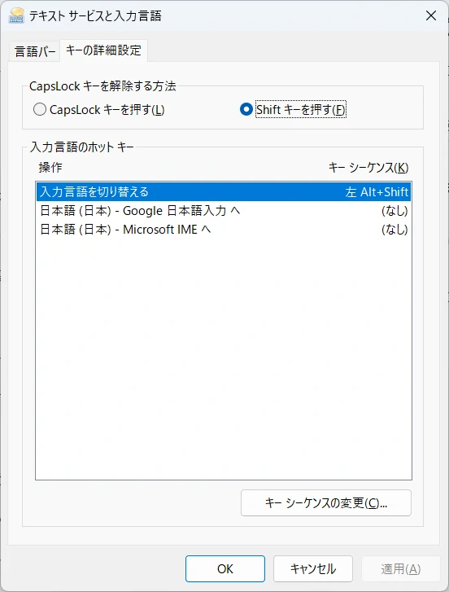
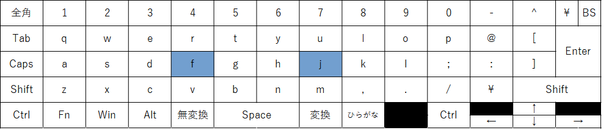
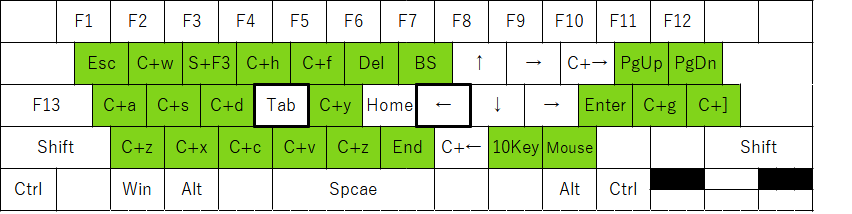
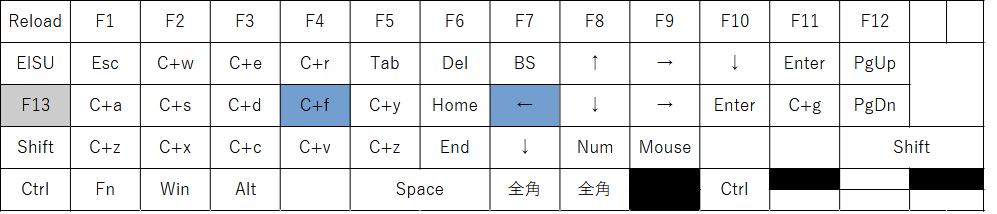
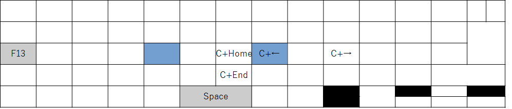
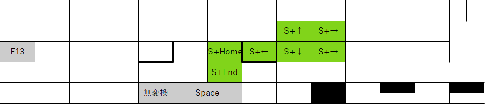
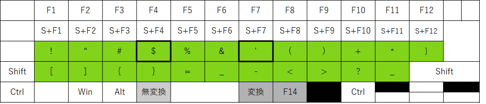
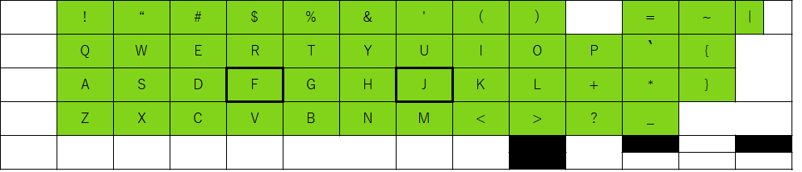
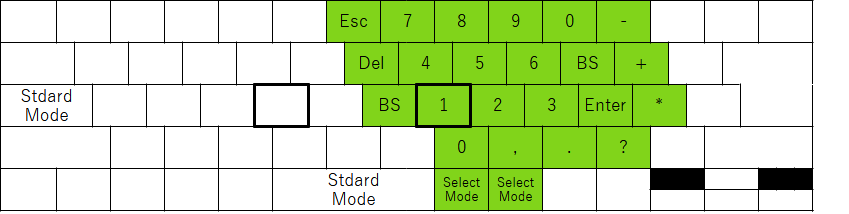

== 概要
* Autohotkey v2のスクリプト
* 二種類のahkファイルを準備、それぞれ排他。使用感も含めて、実験調整中
* 「Space」などを修飾キーとして扱う。スペースキーダウンから300ms未満（スクリプト設定による）のアップで本来のキーを入力、それ以上で何もしない。キーを押しながら他のキーを押すことで、設定された動作 
* 「Caps Lock」「ひらがな」は、ahkでの動作が不安定のため、レジストリでScanCodeを書き換え、F13、F14を割り当てる。レジストリでScanCodeを書き換えないと、AutoHotKeyが正しく扱えない。逆にレジストリを書き換えなければ、ahkファイルのF13に関する設定は無視される。 * 日本語キーボードを使うことが前提
* 設定は、試行錯誤中のもの、かつ、特殊なキー配置を考慮しているので、カスタマイズしたほうがほうがよい
* 誤動作発生の可能性がある（対策は施したが動作環境依存） +
→キーリピート遅くすることで、誤動作に頻度を削減できる（事実上、必須と考えたほうがよい）

* ２つのスクリプト共通でctrl+shift+CapsLockが CapsLock-Onになっている +
 ※ShiftでCapsLock-OffできるようにWndowsを設定したほうがよい

* F13(orスペース)+無変換＋矢印でシフト選択動作（HomeやEndもコードを書いたがなぜかEndが動かないので、実験扱い）
* 隠し機能があるのでahkファイルを参照

== キーマップ
キーの説明 +
C+ ctrlを押しながら +
S+ shiftを押しながら +
A+ altを押しながら +

タイトルの説明 +
and 同時押し + 
or どちらか

=== 標準

=== 標準(レジストリ書き換え)

== space.ahk
=== 概要
* 「Space」や「F13」が修飾キーとして動作する。２つのキーはほぼ同じ役割だが、一部キーバインドが異なる。
* F14(ひらがな)/変換/無変換も修飾キーとして動作する。
* 変換/無変換の単押しは無効。
=== スペース修飾

=== F13修飾

=== (スペース and F13) 修飾

=== (Space or F13) and 無変換 修飾

=== (F14 or 変換 or 無変換) 修飾

=== その他
* ctrl+shift+CapsLock: CapsLock-On
* shift+↑: _
* F13+,(<): 縮小(Visual Stduio,Visual Stduio Code)  
* F13+.(>): 拡大(Visual Stduio,Visual Stduio Code)  
* Space+,(<): 縮小(Visual Stduio,Visual Stduio Code)  
* Space+.(>): 拡大(Visual Stduio,Visual Stduio Code)  

== long_press_shift.ahk
=== 概要
* 「Space」や「F13」が修飾キーとして動作する。2つのキーはほぼ同じ役割だが、一部異なる。
* 各キーの長押しでシフト押し動作。連打はできない。連打したいときは従来通りShiftキーで行うこと。
* (Space or F13)と","の同時押しでテンキー入力モードの切り替え。テンキー入力モード以外の文字入力で解除。
* F14(ひらがな)/変換/無変換も修飾キーとして動作する。
* IMEがOnの場合は、ローマ字に関するキーの長押しシフト押しは無効
* IMEv2.ahkを使った方が安定する。 +
IMEv2.ahkを使わない場合、スクリプト中の +
#Include "IMEv2.ahk" + をコメントアウトして、    IME_GET()  {return 0}を有効化する。 + 
IMEv2.ahkは以下を参照（k-ayaki氏に感謝）+ 

https://github.com/k-ayaki/IMEv2.ahk

=== キー長押し

=== スペース修飾

=== F13修飾

=== (スペース and F13) 修飾

=== (Space or F13) and 無変換 修飾

=== (F14 or 変換 or 無変換) 修飾

=== テンキー入力モード

=== その他
* ctrl+shift+CapsLock: CapsLock-On
* shift+↑: _
