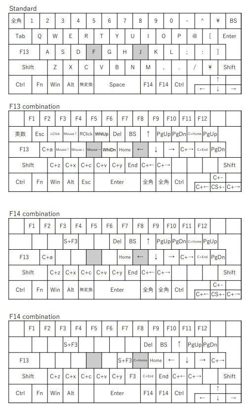

== def.ahk
「Caps Lock」、「ひらがな」、「変換」は、レジストリでScanCodeを書き換えることにより、F13、F14、F14を割り当て。
「Caps Lock」、「ひらがな」は、レジストリでScanCodeを書き換えないと、AutoHotKeyが正しく扱えない。
「変換」、「ひらがな」は、キーボードによって存在しなかったり位置がずれているので、同じコードを与えることで、区別をなくす。
キーレイアウト画像とahkファイルの設定は、差異がある場合がある。

== space.ahk
「Caps Lock」はレジストリでScanCodeを書き換えることによりF13を割り当てる。レジストリでScanCodeを書き換えないと、AutoHotKeyが正しく扱えない。
逆にレジストリを書き換えなければ、ahkファイルのF13に関する設定は無視される。
「Space」を修飾キーとして使う。スペースキーダウンから300ms未満のアップで「Space」を入力、300ms以上で何もしない。スペースキーを押しながら他のキーを押すことで、設定された動作。

