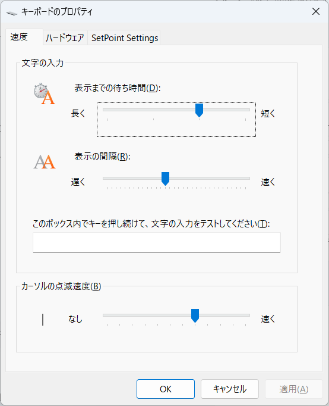
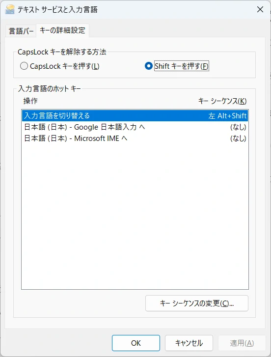
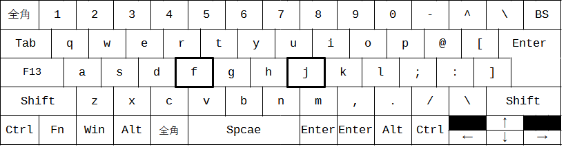
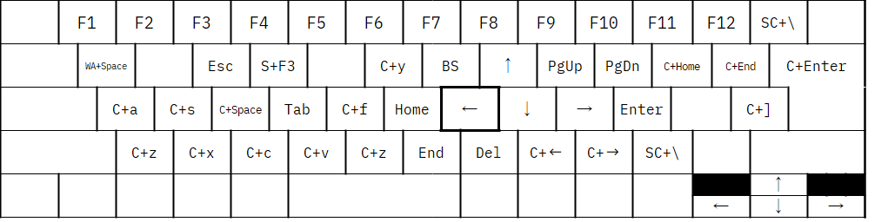
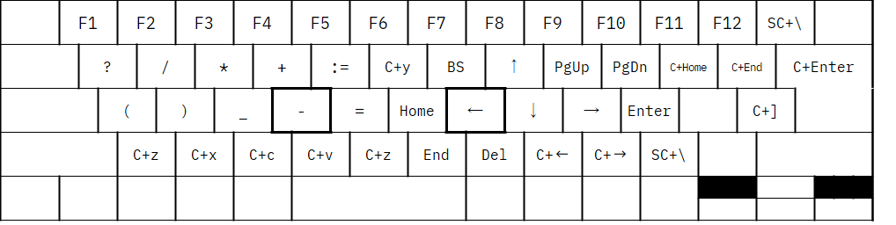
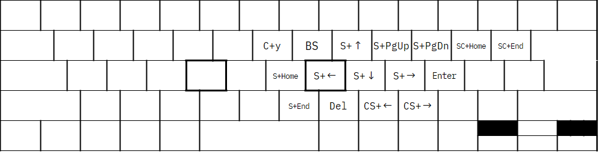
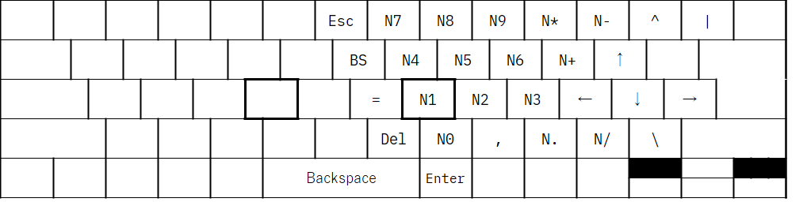
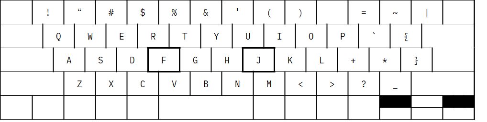
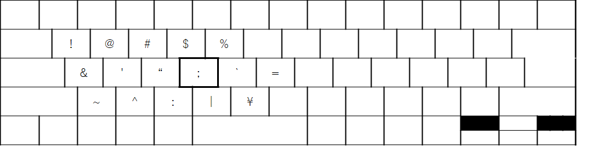
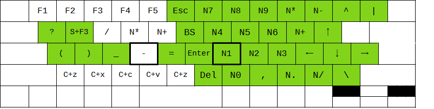

== 緒言
* Autohotkey v2のスクリプト
* 「Space」などを修飾キー(他キーとの同時押しで特殊な操作や文字入力が可能)として動作
** スペースキーダウンから200ms未満（スクリプト設定による）のアップで本来のキーを入力、それ以上で何もしないので修飾キーとして扱える
** キーを押しながら他のキーを押すことで、設定された動作を行う
* 機能の無効化も含めたカスタマイズを推奨
** スクリプトは試行錯誤中で、多機能すぎる→設定は決定版というよりも、サンプルくらいに考えてほしい
** 特殊なキーボード、キー位置が微妙にずれている複数のキーボードを考慮している→複数のキーに同じ機能を割り当てている
** スクリプトをカスタマイズすれば、DvorakやColemak、オリジナルキー配列も可能となる
** 日本語キーボード向け作っているので、USキーボード向けには改変すべきだが、「Space」を修飾キーとして使う機能はむしろ、キーの少ないUSキーボード向けかもしれない
* スクリプトを書き換えれば、IMEがOn/Off状態ごとキーを指定可能
* 「Caps Lock」「ひらがな」は、ahkでの動作が不安定のため、動作を設定する場合はレジストリでScanCodeを書き換え、F13、F14を割り当てておくこと
** レジストリを書き換えなければ、ahkファイルのF13,F14に関する設定は無視される 
* 誤動作発生の可能性があり
** 動作環境依存で誤動作の発生頻度が異なる
*** 通信環境によって伝送遅延があるので長押しタイミングが判定が狂うことがある(長押しシフトはシビア←center_shift.ahkでは未対応)
** キーリピートの開始を遅く（表示までの待ち時間を長く）し、キーリピートを遅く（表示の間隔を遅く）すると改善することがある

* ShiftでCapsLock-Offできる環境以外の動作は不定（以下の設定を推奨）

=== 用語
レイヤー::
キーに押下することで標準外の文字入力やコマンド発行がなされるキー配列

修飾キー::
ShiftやCtrlと同様に、他のキーの同時押しで特殊な動作が行われるキー +
修飾キーを押している間、レイヤーが切り替わる

// モード::
// （修飾キーが押されていなくても）レイヤーが切り替わり固定されている状態

// == long_press_shift.ahk
// === 概要
// * 各キーの長押しでシフト同時押しと同じ動作可能

// === 動作詳細
// * 以下を修飾キーとして取り扱う +
// M1修飾::
// F13
// M2修飾::
// space
// M3修飾::
// Tab or (Alt + F13) 
// M4修飾::
// 無変換 
// M5修飾::
// 変換 or F14

// * 各キーの長押しでシフト押し動作、連打はできないので、そのときは従来通りShiftキーで行うこと
// * M1+Escで、Reloadだが同時にリセットになる、不安定なときに押すとよい
// ////
// * M1+"/"で、テンキー入力モードへの切り替え、該当キー以外のキー押下で解除
// * M1+"."で、キーマウスモードへの切り替え、該当キー以外のキー押下で解除
// * M1+":"で、Funcモードへの切り替え、キー押下で解除

// * M1 + Tで、Ctrl Lock、Ctrl Lock状態で、Ctrlを押さずに何かキーを押すと、Ctrl+キー同時押しを再現、Lockはその後解除される +
// M1 + Tを押すごとに、Win Lock、Alt Lock、Shift Lockと切り替わる、動作はCtrl Lockと同様 +

// ** 例1) M1+T(Ctrl Lock)=>M1を離して=>c → Ctrl+c、ロック解除r + 
// ** 例2) M1+T(Ctrl Lock)=>M1を押したまま=>T(Win Lock)=>M1を離して=>v → Win+v、ロック解除 + 
// * M2+Tで、TS Mode(Two Stroke Mode)、TS Mode状態にして、何かキーを押すと、Ctrlとそのキーの同時押しを再現した動作になる +
// ** 2回キーを押したあとに、モードは解除される + 
// 例) M2+T(TS Mode)=>M1を離して=>k、x → Ctrl+k、Ctrl+x、モード解除 
// ////
// * M1 + PgUp/PgDnで、それぞれ、マウススピードアップ/ダウン
// * 一部のアプリのテキストボックスで誤動作が発生することがある
// ////
// * M1を押したままの状態で、マウスを動かすと低速で移動
// * M1を押すと、モードやロックを解除I
// * 下記の色付きのキーで多くの操作ができ、手の移動、とくに小指の移動を最小限にしている
// ** ただし、Shift+Ctrl+Win+キーなどの、複数の修飾キーによる操作は、手の移動が必要になることもある
// ** これは、60%キーボードでFnを使わずに多くの操作ができることを示す
// *** 数値が小さいほど打ちやすい
// image::img/marker.webp[]
// ////

// *  おまけでM1+Win+aでASRT配列、Reloadすれば元に戻る。他の配列も実装してあるのでスクリプト参照

// === 表記法
// キーの説明::
// S+ Shift修飾 +
// C+ Ctrl修飾 +
// A+ Alt修飾 +
// W+ Win修飾 +
// SC+ Shift+Ctrl修飾 +
// N[x] NumPadのキー ex)N5 NumPadの5

// 色::
// 緑地:shiftキーなど修飾キーを押しながらの効果は無効

// === 初期状態
// image::img/std.webp[]

// === 標準(レジストリ書き換え)
// image::img/stdreg.webp[]

// === long_press_shift有効時の標準状態
// image::img/stdahk.webp[]

// === キー長押し
// image::img/shift.webp[]

// === M1修飾
// image::img/m1.webp[]

// === M2修飾
// image::img/m2.webp[]

// === M3修飾 
// image::img/m3.webp[]

// === M4修飾
// image::img/m4.webp[]

// === M5修飾
// image::img/m5.webp[]

// ////
// === テンキー入力モード
// image::img/num.webp[]
// Esc or M1でモード解除

// === カーソルモード
// image::img/cur_mode.webp[]
// Esc or M1でモード解除 +

// === 選択モード
// image::img/sel_mode.webp[]
// Esc or M1でモード解除 +
// ////

// === Funcモード
// image::img/func.webp[]
// 一度キーを押せば解除 +
// Esc or M1 or M2でモード解除

// === キーマウスモード
// image::img/mouse.webp[]
// Esc or M1でモード解除 +

// === その他 
// * 右Shift+↑: _
// * Ctrl+Shift+M1(CapsLock): CapsLock-On 
// * Win + Alt + Enter: AutoHotkeyのsuspend/resumeの切り替え
// * Shift+全角: 英数
// ////
// === おまけ
// ==== Colemak
// image::img/colemak.webp[]

// ==== FMIX
// image::img/fmix.webp[]
// ColemakよりもQwertyからの入れ替えが少なく覚えやすい
// ////

// == saas.ahk
// === 概要
// スペースとの同時押しでシフトコンビネーションを実現 +
// 基本はlong_press_shift.ahkと同じだが、 以下が排除されている

// * 長押しシフト
// * モード（レイヤー）固定機能
// * マウス関連機能

// === 動作詳細
// * 以下を修飾キーとして取り扱う +
// M1修飾::
// F13
// M2修飾::
// space
// M3修飾::
// Tab or (F13 + Alt) or (F13 + 無変換) 
// M4修飾::
// 無変換 
// M5修飾::
// 変換 or F14

// * 長押しシフトがない分、動作が安定

// === M1修飾
// image::img/m1.webp[]
// FuncLock未対応

// === M2修飾
// image::img/shift.webp[]

// === M3修飾 
// image::img/m3.webp[]

// === M4修飾
// image::img/m4.webp[]

// === M5修飾
// image::img/m2.webp[]
// FuncLock未対応

== space_navi.ahk
=== 概要
「無変換 or 変換 or F14」の同時押しでシフト押下と同じ効果がある +
また、左右のシフトも使える +
// 基本はlong_press_shift.ahkと同じだが、 以下が排除されている

// * 長押しシフト
// * モード（レイヤー）固定機能
// * マウス関連機能

=== 動作詳細
* 以下を修飾キーとして取り扱う +

M1修飾::
F13
M2修飾::
space
M3修飾::
 (F13 + Alt) or (F13 + 無変換) 
M4修飾::
Tab or 無変換
M5修飾::
変換 or F14
M6修飾::
:(Colon)キー 

=== Autohotkey有効時の標準状態

=== M1修飾

=== M2修飾

=== M3修飾 

=== M4修飾

=== M5修飾

=== M6修飾

=== その他
* Win + Alt + Enter: AutoHotkeyのsuspend/resumeの切り替え
* Shift + 全角: 英数
* Ctrl + Shift + F13: CapsLock-On 

== center_shift.ahk
=== 概要
「無変換 or 変換 or F14」の同時押しでシフト押下と同じ効果がある +
また、左右のシフトも使える +
// 基本はlong_press_shift.ahkと同じだが、 以下が排除されている

// * 長押しシフト
// * モード（レイヤー）固定機能
// * マウス関連機能

=== 動作詳細
* 以下を修飾キーとして取り扱う +

M1修飾::
F13
M2修飾::
space
M3修飾::
 (F13 + Alt) or (F13 + 無変換) 
M4修飾::
Tab
M5修飾::
無変換 or 変換 or F14
M6修飾::
:(Colon)キー 

=== Autohotkey有効時の標準状態

=== M1修飾

=== M2修飾

=== M3修飾 

=== M4修飾

=== M5修飾

=== M6修飾

=== その他
* Win + Alt + Enter: AutoHotkeyのsuspend/resumeの切り替え
* Shift + 全角: 英数
* Ctrl + Shift + F13: CapsLock-On 
