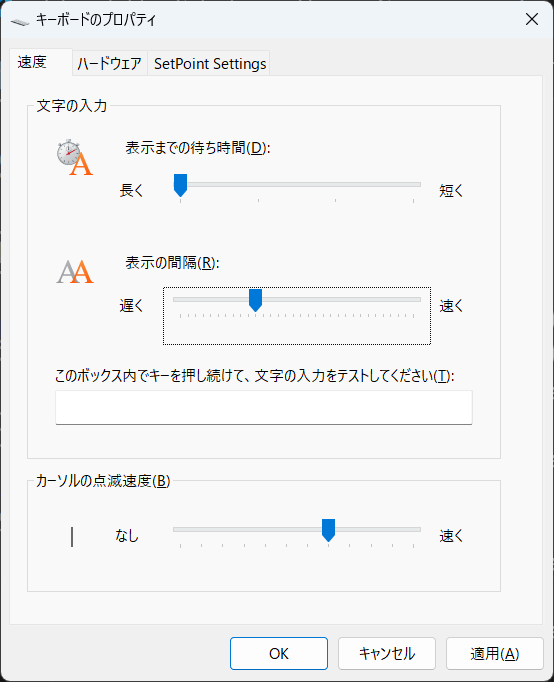
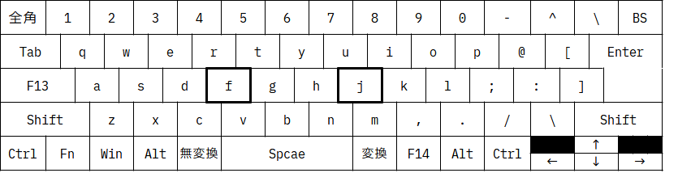
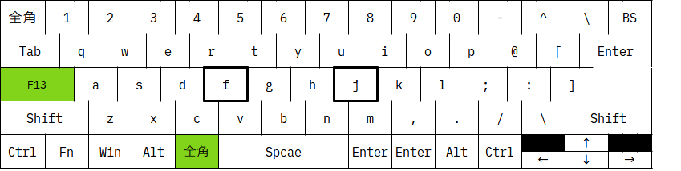
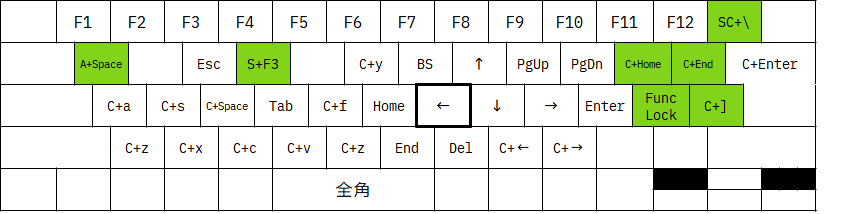
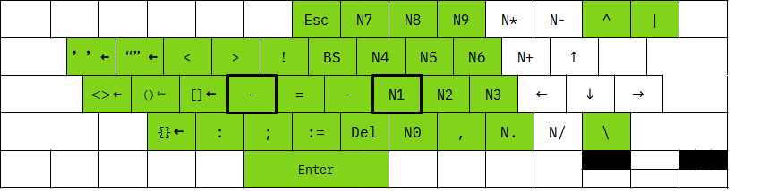
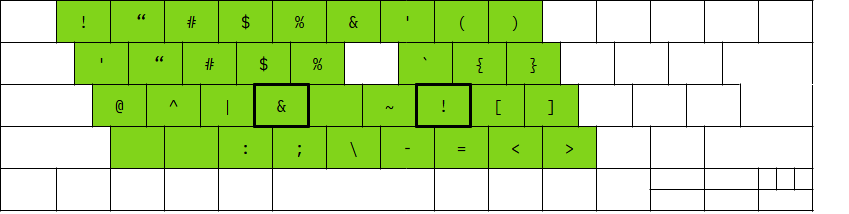
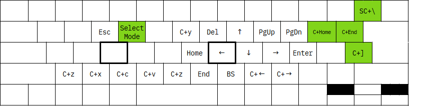

== 緒言
* Autohotkey v2のスクリプト
* 「Space」などを修飾キー(他キーとの同時押しで特殊な操作や文字入力が可能なキー)として扱う
** スペースキーダウンから200ms未満（スクリプト設定による）のアップで本来のキーを入力、それ以上で何もしない
** キーを押しながら他のキーを押すことで、設定された動作 
* 各キーの長押しでシフト押し動作可能
* スクリプトを書き換えれば、IMEがOn/Off状態ごとキーを指定可能
* 「Caps Lock」「ひらがな」は、ahkでの動作が不安定のため、レジストリでScanCodeを書き換え、F13、F14を割り当てておくこと
** レジストリを書き換えなければ、ahkファイルのF13,F14に関する設定は無視される 
* 機能の無効化も含めたカスタマイズを推奨
** スクリプトは試行錯誤中で、多機能すぎる
** 特殊なキーボードのキー配置を考慮している
** スクリプトをカスタマイズすれば、DvorakやColemak、オリジナルキー配列も可能
** 日本語キーボード向け作っているので、USキーボード向けには改変すべきだが、「Space」を修飾キーとして使う機能はむしろ、キーの少ないUSキーボード向けかもしれない
* 誤動作発生の可能性がある
** リモートデスクトップなど、動作環境依存で誤動作の発生頻度が異なる
** キーリピートの開始を遅く（表示までの待ち時間を長く）し、キーリピートを遅く（表示の間隔を遅く）すると改善することがある

* ShiftでCapsLock-Offできる環境以外の動作は不定（以下の設定を推奨）

=== 用語
レイヤー::
キーに押下することで標準外の文字入力やコマンド発行がなされるキー配列

修飾キー::
ShiftやCtrlと同様に、他のキーの同時押しで特殊な動作が行われるキー +
修飾キーを押している間、レイヤーが切り替わる

モード::
（修飾キーが押されていなくても）レイヤーが切り替わり固定されている状態

== long_press_shift.ahk
=== 動作詳細
* 以下を修飾キーとして取り扱う +
M1修飾::
F13
M2修飾::
space
M3修飾::
Tab
M4修飾::
無変換 
M5修飾::
変換 or F14

* 各キーの長押しでシフト押し動作、連打はできないので、そのときは従来通りShiftキーで行うこと
* M1+Escで、Reloadだが同時にリセットになる、不安定なときに押すとよい
////
* M1+"/"で、テンキー入力モードへの切り替え、該当キー以外のキー押下で解除
* M1+"."で、キーマウスモードへの切り替え、該当キー以外のキー押下で解除
* M1+":"で、Funcモードへの切り替え、キー押下で解除

* M1 + Tで、Ctrl Lock、Ctrl Lock状態で、Ctrlを押さずに何かキーを押すと、Ctrl+キー同時押しを再現、Lockはその後解除される +
M1 + Tを押すごとに、Win Lock、Alt Lock、Shift Lockと切り替わる、動作はCtrl Lockと同様 +

** 例1) M1+T(Ctrl Lock)=>M1を離して=>c → Ctrl+c、ロック解除r + 
** 例2) M1+T(Ctrl Lock)=>M1を押したまま=>T(Win Lock)=>M1を離して=>v → Win+v、ロック解除 + 
* M2+Tで、TS Mode(Two Stroke Mode)、TS Mode状態にして、何かキーを押すと、Ctrlとそのキーの同時押しを再現した動作になる +
** 2回キーを押したあとに、モードは解除される + 
例) M2+T(TS Mode)=>M1を離して=>k、x → Ctrl+k、Ctrl+x、モード解除 
////
* M1 + PgUp/PgDnで、それぞれ、マウススピードアップ/ダウン
////
* M1を押したままの状態で、マウスを動かすと低速で移動
* M1を押すと、モードやロックを解除I
* 下記の色付きのキーで多くの操作ができ、手の移動、とくに小指の移動を最小限にしている
** ただし、Shift+Ctrl+Win+キーなどの、複数の修飾キーによる操作は、手の移動が必要になることもある
** これは、60%キーボードでFnを使わずに多くの操作ができることを示す
*** 数値が小さいほど打ちやすい
image::img/marker.webp[]
////

*  おまけでM1+Win+aでASRT配列、Reloadすれば元に戻る。

=== 表記法
キーの説明::
S+ Shift修飾 +
C+ Ctrl修飾 +
A+ Alt修飾 +
W+ Win修飾 +
SC+ Shift+Ctrl修飾 +
N[x] NumPadのキー ex)N5 NumPadの5

色::
緑地:shiftキーなど修飾キーを押しながらの効果は無効

=== 初期状態

=== 標準(レジストリ書き換え)

=== long_press_shift有効時の標準状態

=== キー長押し
image::img/shift.webp[]

=== M1修飾

=== M2修飾
image::img/m2.webp[]

=== M3修飾

=== M4修飾

=== M5修飾

////
=== テンキー入力モード
image::img/num.webp[]
Esc or M1でモード解除

=== カーソルモード

Esc or M1でモード解除 +

=== 選択モード
image::img/sel_mode.webp[]
Esc or M1でモード解除 +
////

=== Funcモード

一度キーを押せば解除 +
Esc or M1 or M2でモード解除

=== キーマウスモード
image::img/mouse.webp[]
Esc or M1でモード解除 +

=== その他 
* 右Shift+↑: _
* Ctrl+Shift+M1(CapsLock): CapsLock-On 
* Win + Alt + Enter: AutoHotkeyのsuspend/resumeの切り替え
* Shift+全角: 英数
////
=== おまけ
==== Colemak
image::img/colemak.webp[]

==== FMIX
image::img/fmix.webp[]
ColemakよりもQwertyからの入れ替えが少なく覚えやすい
////

== saas.ahk
スペース長押しでシフトコンビネーションを実現 +
long_press_shift.ahkに対し、 以下を排除

* 長押し
* モード（レイヤー）固定機能
* マウス関連機能

=== M1修飾

FuncLock未対応

=== M2修飾
image::img/shift.webp[]

=== M3修飾

C+z,C+x,C+c,C+vは、未対応

=== M4修飾

=== M5修飾
image::img/m2.webp[]